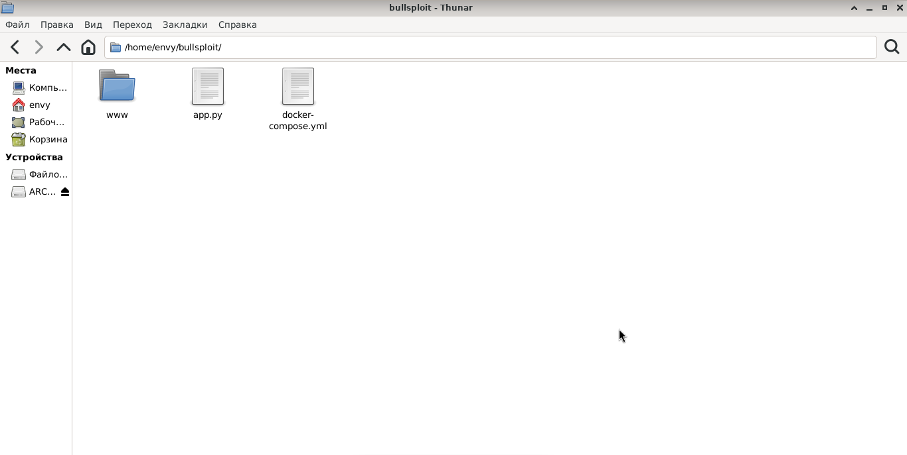
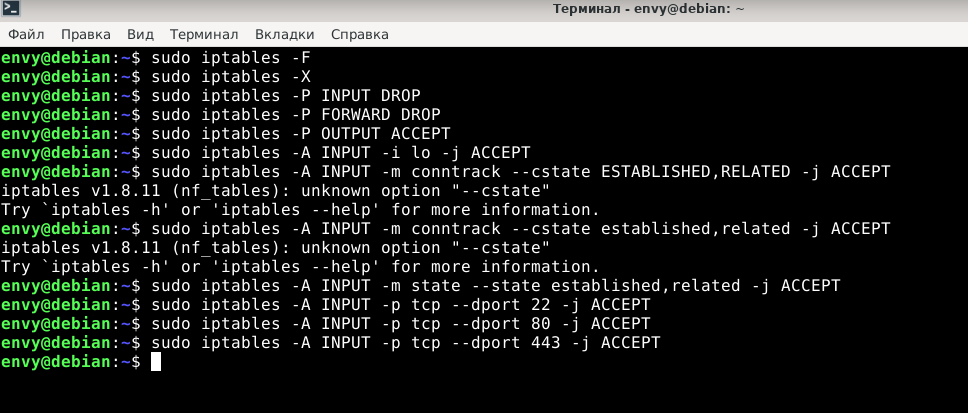
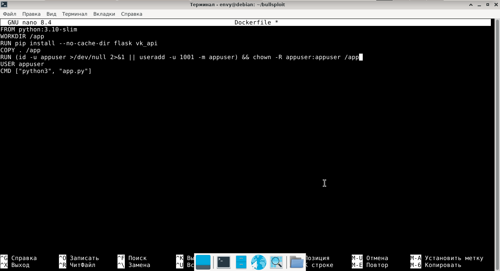
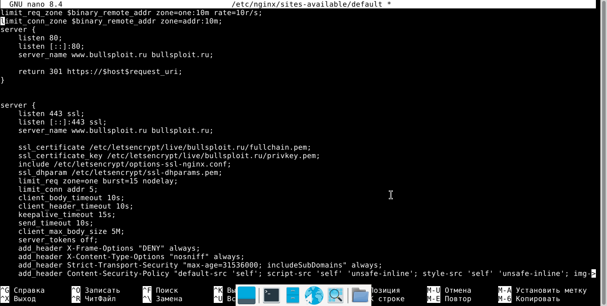
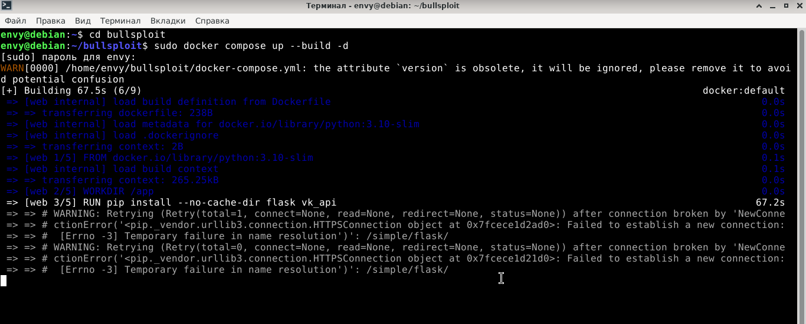
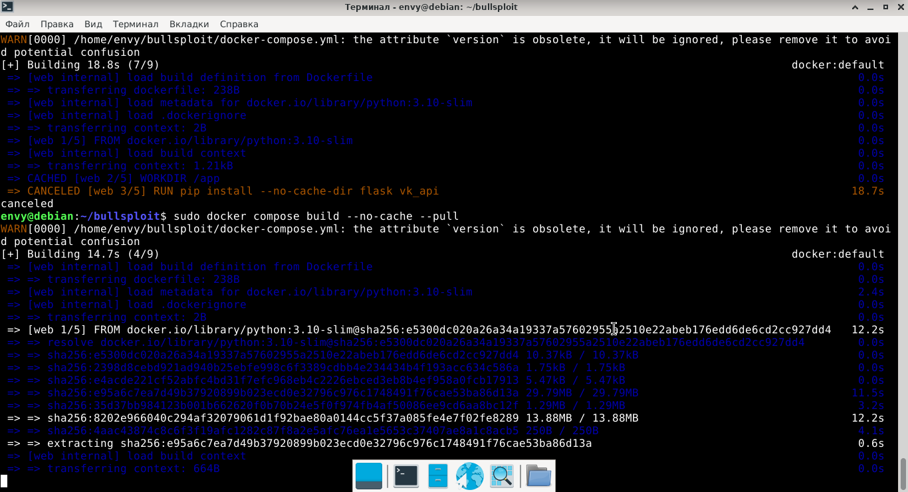
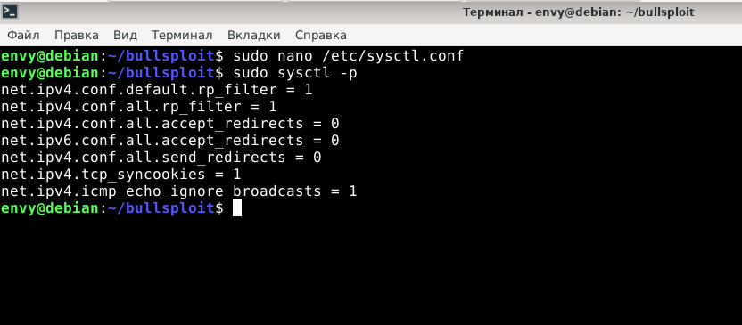
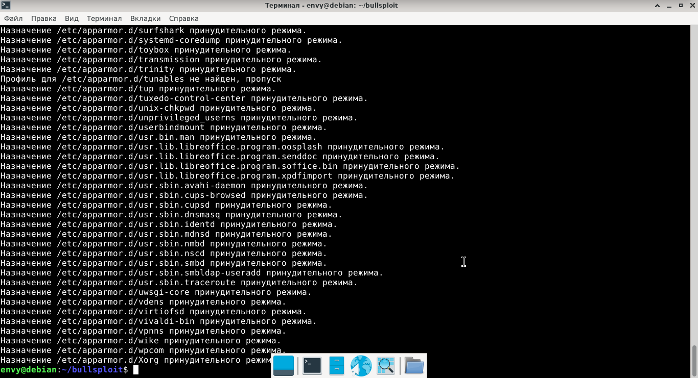

# Debian hardening
## Репозиторий о том, как я защитил свое веб приложение и минимизировал различные последствия от взлома моей дебиан машины.

Все нижеописанные действия проделанные мною по обеспечению закаливания своей операционной системе производились на моем ноутбуке, который выступал хостом для моего веб приложения, сайта для b2b стартапа https://bullsploit.ru

Тех. стек проекта: докер + фронтенд на css, html + бекенд на пайтоне + nginx подсистемный, вне докера

Стоит быть честным и упомянуть, настройка конфигурации nginx проводилась с помощью ии ассистента, синтаксис nginx мне неизвестен.

Вот как выглядел небезопасный проект выглядел изначально: 

Первым же делом - я принялся настраивать правила для фаерволла, чтобы максимально ограничить свою машину для других в интернете.
Тобишь стер старые правила, добавил на конец цепочки сбрасывать входящие и транзитные подключения, а выходящие разрешил. Также разрешил своему компьютеру устанавливать любые соединения на локальном адресе 127.0.0.1 
и через state разрешил отправку ответов на мои запросы. А также дал своему компьютеру выход в интернет по http, https и ssh.

Потом я создал докерфайл, чтобы лучше контролировать свой контейнер и сделать его безопаснее. Для лучшей производительности я использовал пайтон 3.10 слим версии. В нем же прописал добавление всего фронтенда. На 5,6 строке я прописал скрипт, чтоб создавался пользователь с айди 1001(айди до 1000 может совпасть с правами критических системных пользователей что может привести к компрометации хоста) и ему присваивались права обычного пользователя и выдавались разрешения на владение всеми файлами рабочей директории

Затем я настроил конфигурацию системного nginx ради безопасности, добавил редирект с http на https, защиту от DoS, которая не позволяет делать более 10 запросов в секунду с одного айпи. Также добавил ограничение на количество активных tcp соединений с одного айпи адреса, ссл сертификат, hsts и многое другое.

Далее, когда я захотел уже развернуть докер-контейнер с содержимым и протестировать сайт, мне встретилась данная ошибка на этапе билда:

Это как раз из-за правила iptables -p FORWARD DROP докер не мог достучаться из своей виртуальной nat сети до серверов pypl, ведь для компьютера это как раз-таки промежуточный трафик.

После того как я временно отключил правила iptables все заработало и я смог скачать нужные библиотеки докером.

Далее я решил изменить настройки ядра. Первая строчка - reversepath проверяет, совпадает ли интерфейс, через который пришел пакет с маршрутом по которому сервер отправил бы обратно, если не совпадает - дропается. 

Следующие 2 строки нацелены на минимизацию возможности MITM атаки, посредством отключения icmp редиректа.

net.ipv4.conf.all.send_redirects = 0 запрещает слать icmp пакеты другим устройствам.

net.ipv4.tcp_syncookies = 1 защита от syn-флуда. По умолчанию на syn запрос выделяется память для соединения. Но данная настройка решает эту проблему и не выделяет память, пока клиент не прислал syn-ack.

строка net.ipv4.icmp_echo_ignore_broadcasts = 1 запрещает системе отвечать на icmp пакеты. Защита от атак типа smurf

Последним штрихом харденинга дебиан машины стало включение apparmor в режиме enforce

